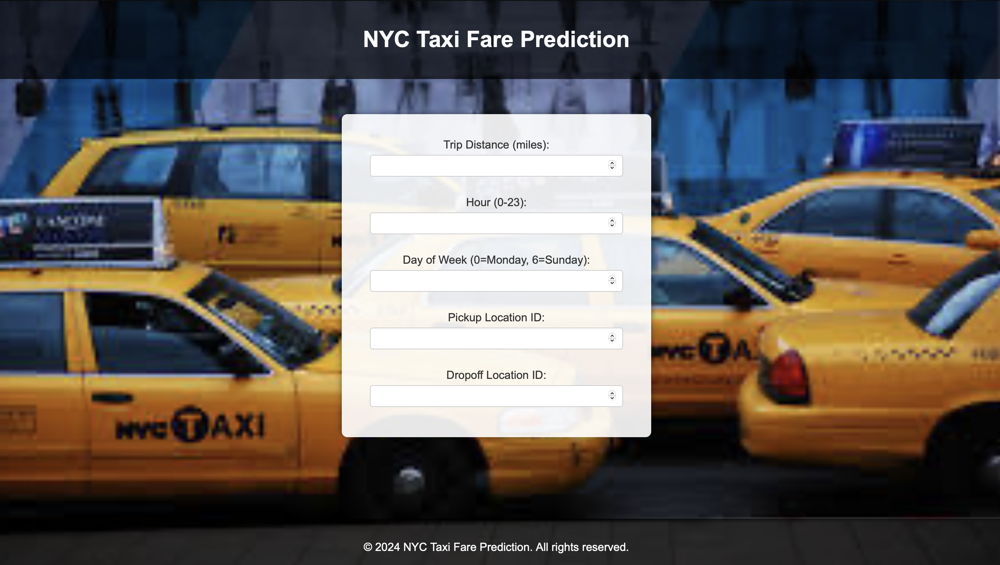

# NYC Taxi Fare Prediction

## Overview
This project predicts NYC taxi fares based on key trip details like trip distance, pickup/drop-off times, and rush hour information. It uses a Random Forest model trained on NYC Yellow Taxi data and provides a user-friendly web interface to input trip details and get fare predictions.

---
## Features
- **Accurate Fare Predictions**:
  - Built with a Random Forest model achieving **R² = 0.94**  **RMSE of $2.70, and MAE of $1.08**.
  - Trained on cleaned and preprocessed NYC Yellow Taxi trip data.
- **Web App**:
  - Input trip details and get real-time fare predictions.
  - Professional and responsive design with easy-to-use form.
- **Data Insights**:
  - Analyzed key trends in taxi fares, including factors like trip distance and time of day.

---
## Visualizations

1. Average Fare by Day of the Week
This chart shows the average fare for each day of the week, revealing patterns in taxi usage and fare trends.

2. Fare Amount vs. Trip Distance
A scatter plot visualizing the relationship between trip distance and fare amount.

3. Feature Importance
This bar chart highlights the importance of different features in the Random Forest model.

4. Actual vs. Predicted Fares
A scatter plot comparing actual fares to model-predicted fares, demonstrating the model's performance.

5. Top Pickup Zones/ID
This heatmap displays the frequency of trips originating from the most popular pickup zones.

---

## Web App

Users can interact with the web app to predict taxi fares by providing the following trip details:

Trip Distance (in miles)
Hour of the Day (0-23)
Day of the Week (0 = Monday, 6 = Sunday)
Rush Hour Status (1 = Yes, 0 = No)

## Web App
Below is a snapshot of the web application:

## Project Setup
1. Clone the repository:

<git clone <repository-link>
cd NYC_Taxi_Fare_Prediction>

## Credits

Dataset: NYC Yellow Taxi Data

